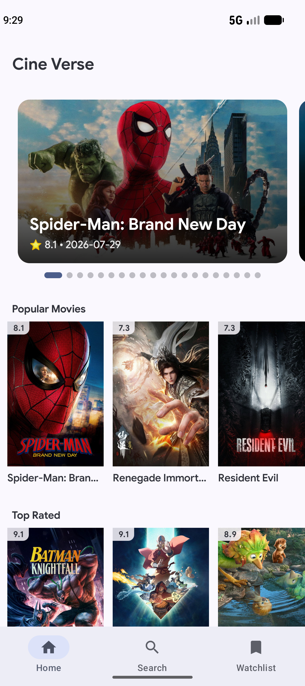
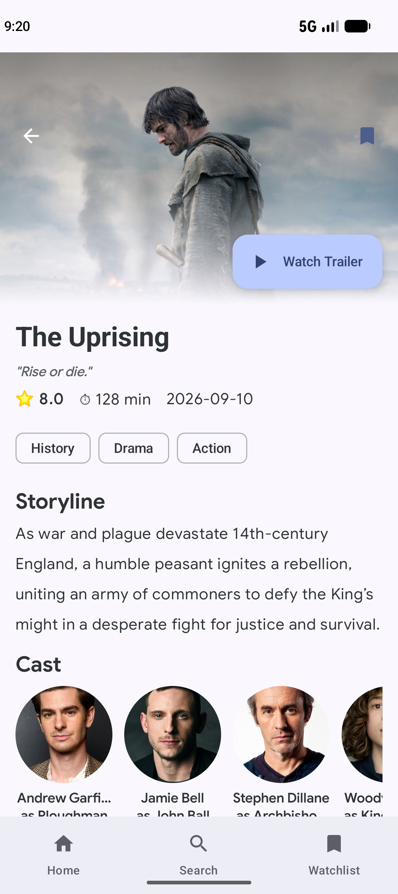
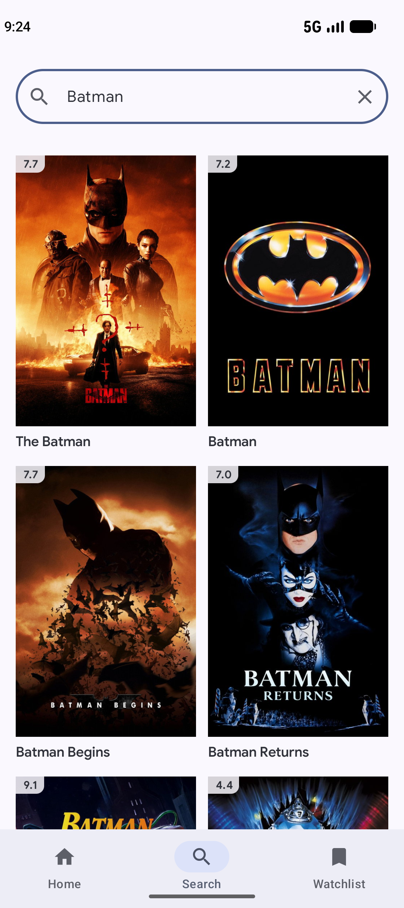
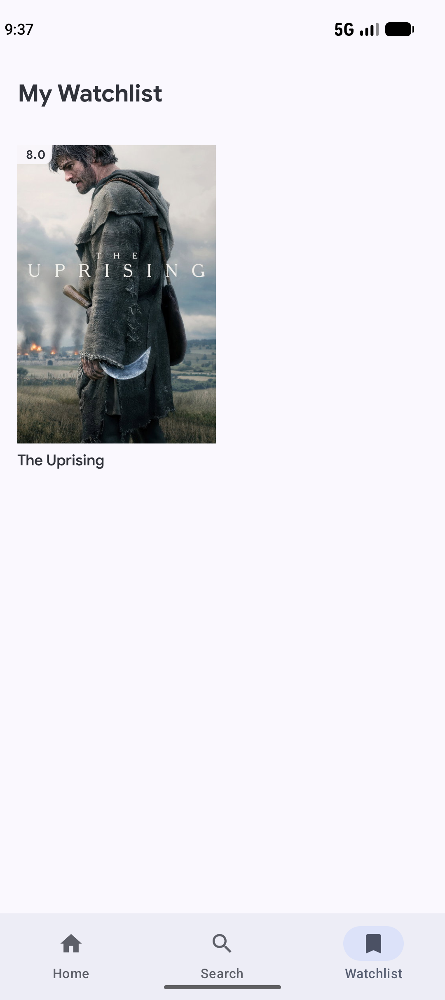

# 🎬 CineVerse

<p align="center">
  
</p>

<p align="center">
  <b>A modern, high-performance Android movie app built with Jetpack Compose & Clean Architecture.</b>
</p>

<p align="center">
  <a href="https://kotlinlang.org"></a>
  <a href="https://developer.android.com/jetpack/compose"></a>
  <a href="https://dagger.dev/hilt/"></a>
  <a href="https://developer.android.com/training/data-storage/room"></a>
  <a href="https://square.github.io/retrofit/"></a>
</p>

---

## 🌟 Features

- 🍿 **Hero Banner Carousel**: Interactive auto-scrolling featured trending movies banner with rating
  and release badges.
- 📱 **Categorized Movie Rows**: Explore Trending, Popular, Top Rated, and Upcoming movies in
  horizontal scrolling rows.
- 🔍 **Real-Time Movie Search**: Instant movie searching with query feedback and search clearing
  actions.
- 🎬 **Rich Movie Details**: High-resolution backdrop header, taglines, ratings, runtimes, release
  dates, genre chips, storylines, full cast actor cards, and direct YouTube trailer playback.
- 🔖 **Offline Watchlist**: Save and remove your favorite movies locally using Room Database with
  live bookmark state syncing.
- 🔄 **Pull to Refresh**: Seamlessly refresh movie collections using modern Compose
  `PullToRefreshBox`.
- 🎨 **Material 3 Dark Theme**: Polished dark theme with smooth gradient overlays and edge-to-edge
  support.

---

## 📸 Screenshots

<div align="center">

|                           Home Screen                            |                            Movie Details                             |                           Real-time Search                           |                             Offline Watchlist                              |
|:----------------------------------------------------------------:|:--------------------------------------------------------------------:|:--------------------------------------------------------------------:|:--------------------------------------------------------------------------:|
|  |  |  |  |

</div>

---

## 🏗️ Tech Stack & Architecture

CineVerse is built following **Clean Architecture** principles and the **MVVM (
Model-View-ViewModel)** pattern with Unidirectional Data Flow (UDF).

```
 ┌─────────────────────────────────────────────────────────┐
 │                       UI Layer                          │
 │      (Jetpack Compose + Material 3 + ViewModels)         │
 └────────────────────────────┬────────────────────────────┘
                              │ Flow / StateFlow
 ┌────────────────────────────▼────────────────────────────┐
 │                     Domain Layer                        │
 │       (Pure Kotlin Models & Repository Contracts)       │
 └────────────────────────────▲────────────────────────────┘
                              │
 ┌────────────────────────────┴────────────────────────────┐
 │                      Data Layer                         │
 │  (Retrofit Remote API + Room Local Database + Mappers)  │
 └─────────────────────────────────────────────────────────┘
```

### Libraries & Technologies

- **UI & Layout**: [Jetpack Compose](https://developer.android.com/jetpack/compose), Material 3
  design system, Material Icons Extended.
-
**Navigation**: [Jetpack Navigation Compose](https://developer.android.com/guide/navigation/navigation-3)
with bottom navigation bar integration.
- **Dependency Injection**: [Hilt (Dagger)](https://dagger.dev/hilt/) for clean component lifecycle
  management.
-
**Networking**: [Retrofit 2](https://square.github.io/retrofit/) + [OkHttp 4](https://square.github.io/okhttp/)
with custom query interceptor for TMDB API keys.
- **Async & Reactive Streams**: Kotlin Coroutines + `StateFlow` + `collectAsStateWithLifecycle`.
- **Image Loading**: [Coil 3](https://coil-kt.github.io/coil/) for Compose image caching and async
  loading.
- **Local
  Database**: [Room Database](https://developer.android.com/training/data-storage/room) + [KSP](https://kotlinlang.org/docs/ksp-overview.html)
  for offline Watchlist persistence.
- **Data Source**: [The Movie Database (TMDB) API](https://www.themoviedb.org/documentation/api).

---

## 📂 Project Structure

```
com.raye.cineverse/
├── CineVerseApp.kt                # Application class initialized with @HiltAndroidApp
├── MainActivity.kt                # Main Activity with edge-to-edge Compose theme
│
├── data/                         # Data Layer (Network, Local Database, Repositories)
│   ├── local/                    # Room Database, WatchListDao, WatchListEntity
│   ├── remote/                   # Retrofit TmdbApiService & DTOs
│   ├── mapper/                   # DTO to Domain Model Mappers
│   └── repository/               # MovieRepositoryImpl implementation
│
├── di/                           # Dependency Injection (Hilt Modules)
│   ├── DatabaseModule.kt         # Room Database provider
│   ├── NetworkModule.kt          # Retrofit & OkHttp client provider
│   └── RepositoryModule.kt       # Repository binding
│
├── domain/                       # Domain Layer (Pure Kotlin Business Logic)
│   ├── model/                    # Movie, MovieDetails, Cast models
│   └── repository/               # MovieRepository contract
│
├── navigation/                   # Navigation setup & route definitions
│   ├── Screen.kt
│   └── MainScreen.kt
│
├── presentation/                 # Presentation Layer (Compose Screens & ViewModels)
│   ├── home/                     # HomeScreen, HomeViewModel, HeroCarousel, MovieCard
│   ├── detail/                   # DetailScreen, DetailViewModel, ActorCard
│   ├── search/                   # SearchScreen, SearchViewModel
│   └── watchlist/                # WatchListScreen, WatchListViewModel
│
└── ui/theme/                     # Material 3 Theme, Typography & Color Definitions
```

---

## 🚀 Getting Started

### Prerequisites

- **Android Studio**: Ladybug (2024.2.1+) or newer
- **JDK**: Java 11 or higher
- **Android SDK**: Compile SDK 37, Min SDK 24
- **TMDB API Key**: Get a free API key from [TMDB API](https://www.themoviedb.org/settings/api).

### Installation & Setup

1. **Clone the Repository**
   ```bash
   git clone https://github.com/ubaidraye/Cine-Verse.git
   cd Cine-Verse
   ```

2. **Add TMDB API Key**
   Open or create `local.properties` in the project root directory and add your TMDB API key:
   ```properties
   TMDB_API_KEY=your_tmdb_api_key_here
   ```

3. **Build and Run**
   Open the project in Android Studio, sync Gradle dependencies, and run the app on an Android
   device or emulator.

---

## 📄 License

```
Copyright 2026 Raye

Licensed under the Apache License, Version 2.0 (the "License");
you may not use this file except in compliance with the License.
You may obtain a copy of the License at

    http://www.apache.org/licenses/LICENSE-2.0

Unless required by applicable law or agreed to in writing, software
distributed under the License is distributed on an "AS IS" BASIS,
WITHOUT WARRANTIES OR CONDITIONS OF ANY KIND, either express or implied.
See the License for the specific language governing permissions and
limitations under the License.
```
